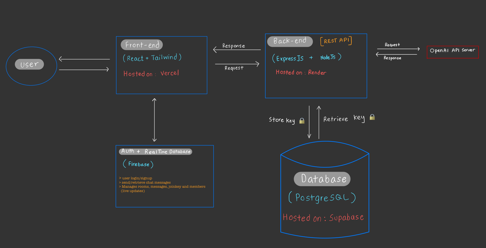

# 🧠 CoChat — A Collaborative, GPT-Powered Chatroom


CoChat lets multiple users join shared chatrooms and interact with GPT using their own encrypted API keys — securely and privately

## 🚀 Try It Now

**🔗 Live Demo:** [cochat-front.vercel.app](https://cochat-front.vercel.app/login)

> No setup required — jump in and start chatting with GPT in shared rooms.

---

---

### 🛠️ How to Use

1. **Sign Up & Verify**
   - Use your email to sign up.
   - Click the verification link sent to your inbox.
   - Log in after verifying.

2. **Enter Your OpenAI API Key**
   - You’ll be prompted to securely enter your OpenAI key.
   - The key is encrypted and stored **server-side**.

3. **Create or Join a Room**
   - You can create a new room or join one with a Room ID + Join Key.

4. **Start Chatting**
   - Messages are shared in real time.
   - GPT replies with full conversation context.

> 🔐 Each user's GPT access is private and secure — API keys are never exposed.

---

### 💬 Message Commands

| Command    |  Description                                                                |
|------------|-----------------------------------------------------------------------------|
| *(none)*   | Regular message, stored and included in GPT prompt context                  |
| `/gpt`     | Triggers a GPT response using the full room context so far                  |
| `/priv`    | Sends a private message **not included** in GPT context (for human eyes only) |

> 💡 Example:
> ```
> /gpt What are some good names for a productivity app?
> ```


## 📚 Table of Contents

- [🧱 Tech Stack](#-tech-stack)
- [📐 Architecture Overview](#-high-level-architecture-overview)
- [✅ Features](#-features)
- [🤔 Design Decisions](#-design-decisions)
- [⚠️ Limitations & Future Improvements](#️-limitations--future-improvements)


### 🧱 Tech Stack

| Area        | Technology                                                |
|-------------|-----------------------------------------------------------|
| Frontend    | React, Tailwind CSS                                       |
| Backend     | Node.js, Express.js                                       |
| Auth        | Firebase Authentication                                   |
| Realtime DB | Firebase Realtime Database                                |
| Database    | Supabase (PostgreSQL)                                     |
| Hosting     | Vercel (Frontend), Render (Backend), Supabase (Database)  |
| Encryption  | Node.js crypto module (AES-256)                           |
| API         | OpenAI                                                    |
| Routing     | React Router                                              |
| Utility     | UUIDv6, pg                                                |


## 📐 High-Level Architecture Overview




## 📸 Screenshots

Coming soon...


## ✅ Features

- 🔐 **Secure GPT Requests with Encrypted API Keys**  
  Each user's OpenAI key is AES-encrypted on the backend before storage and used securely at runtime. 

- 🧱 **Room-Based Chat System**  
  Create, join, or own persistent chatrooms with others.  

- 🔄 **Realtime Chat Messaging**  
  Live updates powered by Firebase Realtime Database.  

- 🧠 **Contextual GPT Conversations**  
  GPT receives prompt history and room context for coherent replies.  

- 🔑 **Encrypted API Key Storage (AES-256)**  
  Keys are encrypted with Node.js crypto and stored in Supabase securely.  

- 🔐 **Email Verification with Firebase Auth**  
  Only verified users can log in and access rooms.


## 🤔 Design Decisions

### Why not store API keys in frontend?

   > Exposing OpenAI keys on the frontend allows any user or attacker to extract it.
   > Keys are sent to backend on room creation and AES-encrypted before storage.
   > On GPT request within a room, the key is retrieved, decrypted, and used server-side

### Why encrypt the keys?

   > Even if the database is compromised, keys stay unreadable without the secret key.
   > Follows security best practices for sensitive credentials.

### Why Firebase Realtime Database?
   > Excellent for low-latency chat messaging.
   > Auth and RTDB integrate seamlessly for MVP speed.


## ⚠️ Limitations & Future Improvements
  
- 🚫 No rate-limiting on OpenAI requests (can be abused).  
- 🧪 Needs better error handling for expired verification links.  
- 🧱 No support yet for role-based access or permissions.
- 📱 UI/UX needs more polish for production readiness.
                  