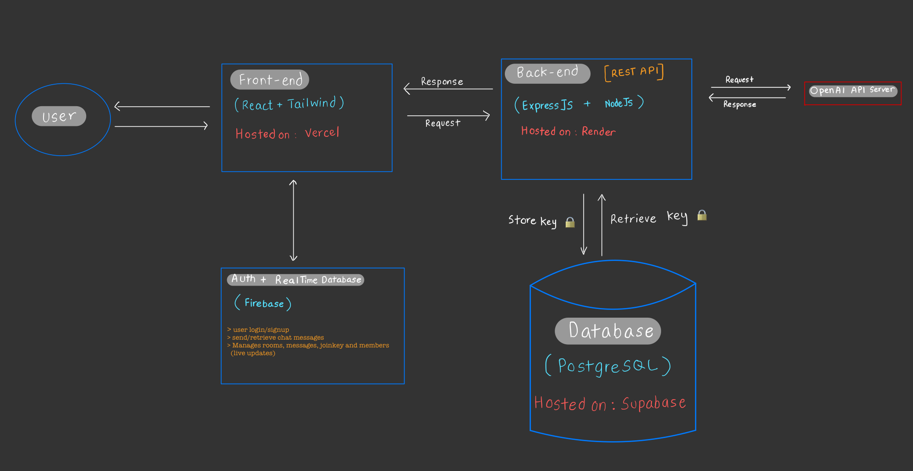

🧠 CoChat — A Collaborative, GPT-Powered Chatroom

CoChat lets multiple users join shared chatrooms and interact with GPT using their own encrypted API keys — securely and privately

📦 Tech Stack
Area                 Technology
Frontend	            React, Tailwind CSS
Backend	            Node.js, Express
Auth	               Firebase Auth
Realtime DB	         Firebase Realtime Database
Database	            PostgreSQL + pg
Hosting	            Vercel (Frontend), Render (Backend), Supabase (Database)
Encryption	         Node.js crypto module (AES-256)
API                  OpenAI
Navigation           React Router
Others               UUIDV6, 

📐 High-Level Architechure Overview

📸 Screenshots

✅ Features

   🔐 End-to-End GPT Requests with Encrypted API Keys

   👥 Room-Based Chat System (Create/Join/Own Rooms)

   🔄 Realtime Messaging with Firebase

   🧠 GPT Context Building (Prompt history & responses)

   📧 Authentication + Email Verification with Firebase before login allowed

🤔 Design Decisions

   Why not store API keys in frontend?

      Exposing OpenAI keys on the frontend allows any user or attacker to extract it.

      Keys are sent to backend on room creation and AES-encrypted before storage.

      On GPT request within a room, key linked to that room is retrieved from database, decrypted, used for a request to openAI, get the response and display to frontend

   Why encrypt the keys?

      Even if the database is compromised, keys stay unreadable without the secret key.

      Follows security best practices for sensitive credentials.

   Why Firebase Realtime Database?

      Excellent for low-latency chat messaging.
      Auth and RTDB integrate seamlessly for MVP speed.

⚠️ Limitations & Future Improvements
   Area	          Limitation	                          Planned Fix
   API Abuse	    Room members could abuse GPT         Rate Limiting 

   GPT scaling     No caching or batching               Add queue, debounce, or batching 
                                                        for GPT calls 

   Key Rotation    No way to rotate stored OpenAI keys  Add key update UI in dashboard +
                                                        Link to storekey route and blah

   Cold Delay      Backend takes a while for first GPT  Schedule cron jobs to ping 
                   request because of Render free tier  backend periodically  throttle                                    
                   
                  